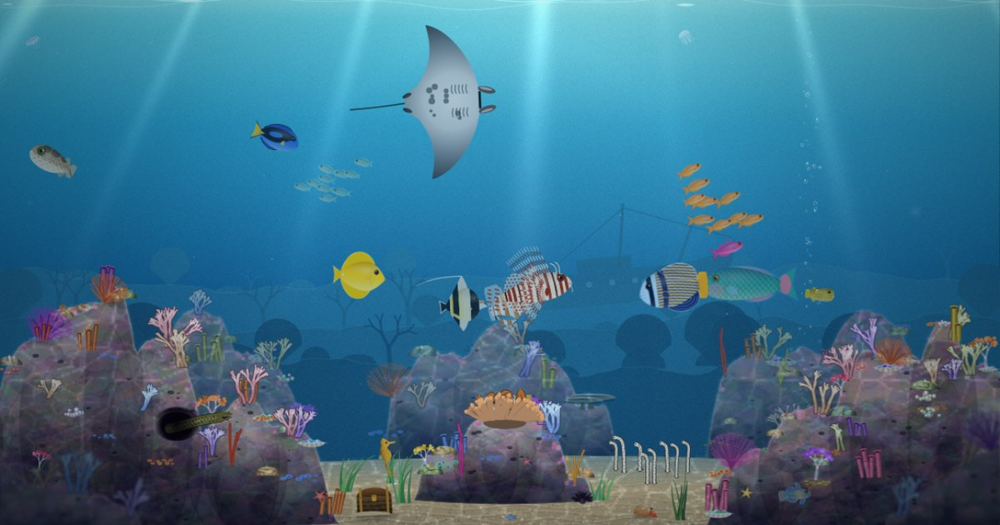

# Reefglass

**Live at [reefglass.fish](https://reefglass.fish)**

A full-screen, procedurally drawn coral reef aquarium in a single HTML page: about twenty species, a real
day/night cycle, and rare special visitors. It uses Canvas 2D and plain JavaScript; the page loads no
libraries and no images. Every fish, coral, ray of light and passing whale shark is painted in code.

## About this project

Reefglass is a demo of **Claude Opus 5.5**'s procedural drawing and animation abilities, and of how far it
can take a loosely specified idea. The whole thing grew from this one prompt:

> Create a web page that is a full screen colorful, interesting, and detailed full page aquarium. Include a
> variety of species and an occasional special visitor. Like the classic After Dark, but better.

From that starting point, Claude designed the species list and their painted sprites, the schooling and
feeding behaviour, the live sunrise/sunset and moon-phase lighting, the caustics and fluorescence, the
visitor schedule, the field-guide facts and the ambient sound. A later session added a performance pass,
a share image, and a few bug fixes and UX tweaks before launch.

## Build & deploy
    ./build.sh               # src/ -> reefglass.html (artifact fragment) + dist/index.html (standalone)
    npx wrangler deploy      # static assets from dist/ to reefglass.fish (see wrangler.jsonc)
The first deploy creates the `reefglass` Worker and attaches the custom domains reefglass.fish and
www.reefglass.fish (the zone must be on the same Cloudflare account). `dist/_headers` sets basic headers.
To deploy your own copy, change or remove the `routes` in `wrangler.jsonc` (without them it gets a workers.dev URL).
`dist/og.jpg` (the share image) and `dist/_headers` are hand-maintained; `build.sh` only writes the two HTML files.

## Time modes
- **Live** (default): lighting follows local sunrise/sunset (computed from date, ~36°N, DST-aware) and moon phase;
  visitors every 2.5–7 min. Captions never appear while the UI is idle, so it can run unattended.
- **Demo**: a whole day in 7 minutes (`CYCLE_SECONDS`), visitors every 35–75 s.
- **Day / Night**: locked. The chosen mode is remembered in localStorage.
Open `dist/index.html` in a browser to test locally. The page is one classic <script>; files share top-level scope and are
concatenated in the order listed in build.sh.

## Layout of src/
| File | What it holds |
|---|---|
| 00_head.html | <title>, CSS, dock/caption/tag markup |
| 01_core.js | utils, seeded RNG, noise, canvas sizing, `Sprite` (mips + fog silhouette), depth, time of day, perf governor |
| 02_env.js | background water & distant ridges, light rays, surface shimmer, caustics, grading, vignette, glow sprites |
| 03a_reef_paint.js | painters: rock mounds, corals, sponges, clams, starfish, shells (painted once into layers) |
| 03b_reef_build.js | reef layout, back/front/foreground layers, fluorescence layer, caustic mask, heightmap, anchors |
| 04_life.js | anemone, seagrass, garden eels, treasure chest, bubbles, marine snow, sparks, food, jellyfish |
| 04b_life_extra.js | moray in the cave, hermit crab |
| 05a/05b_fish_paint.js | fish species sprites (body/tail/pectoral painted in body-length units) + seahorse |
| 06_fish.js | `Fish` behaviour (cruise, picker, hover, home, bottom, school/boids, feeding, fleeing, night rest) |
| 07/08_visitors*.js | special visitors + schedule (`VISITORS`, `summonVisitor`, `updateVisitors`) |
| 09_main.js | WebAudio, tap-to-identify labels, captions, render pipeline, input, resize, boot |

## Conventions
- World units are CSS px; `U` = 1% of min(H, W*1.15). Sizes are expressed in U.
- `z` depth: 0 = against the glass, 1 = far. Buckets: far > 0.62 > mid > 0.3 > near.
  Draw order: bg → far → rays → back reef → mid → front reef → caustics → reef life → near → fg → grade → glows.
- Night glow is drawn after the multiply grade with 'lighter'.
- Debug hooks: `reef.summon('shark')`, `reef.mode('night')`, `reef.feed()`, `reef.advance(seconds)`.

## License
[MIT](LICENSE)
